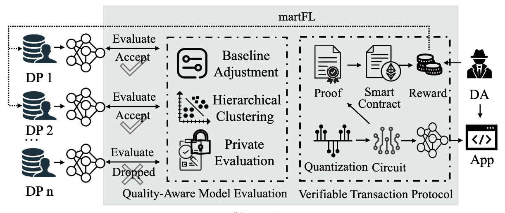

# martFL
The prototype of ACM CCS 2023 paper "martFL: Enabling Utility-Driven Data Marketplace with a Robust and Verifiable Federated Learning Architecture". This work features a robust and verifiable Federated Learning architecture underpinned by a secure model evaluation protocol to remove malicious model updates and a zero-knowledge proving system that ensures fair data trading. [Arxiv](https://arxiv.org/abs/2309.01098)



**WARNING**: This is an academic proof-of-concept prototype, and in particular has not received careful code review. This implementation is NOT ready for production use.

## Overview

We implemented our martFL framework with Pytorch, Zokrates, and Solidity. We've outlined the organization of this repository:

- `src`: It contains the Python code for martFL.
- `datasets`: It contains the necessary dataset files.
- `circuit`: It contains the circuit of the verifiable aggregation, which is implemented using [ZoKrates](https://zokrates.github.io/). 
- `smart_contract`: It contains the trading smart contract, which is implemented using [Solidity](https://soliditylang.org/).
- `SEAL-Python`: The SEAL library for homomorphic encryption. Repository link: https://github.com/Huelse/SEAL-Python.git
- `quantized_data`: The quantized data that was generated during the model training process.
- `save_result & models`: It contains the training results and models, respectively.

## Dependencies

The script has been tested running under Python 3.7.13. The dependencies are summarised in `requirements.txt`.

## Reference
If you take advantage of martFL in your research, please cite the following in your manuscript:

```
@inproceedings{li2023martfl,
  title={martFL: Enabling Utility-Driven Data Marketplace with a Robust and Verifiable Federated Learning Architecture},
  author={Li, Qi and Liu, Zhuotao and Li, Qi and Xu, Ke},
  booktitle={ACM SIGSAC Conference on Computer and Communications Security (CCS)},
  pages={1496--1510},
  year={2023}
}
```
